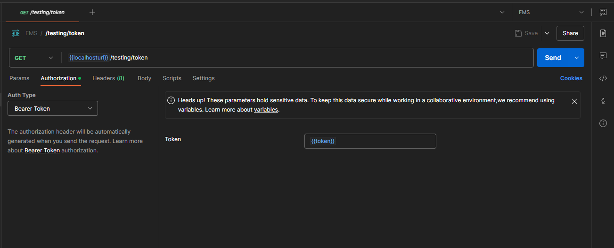

## Postman collection FMS

###### How to import `FMS.postman_collection.json`  to your postman locally

* Open postman application
* At the left sidebar


* open FMS.postman_collections.json

###### How to update collection

* at your postman locally export your collection by clicking the folder three dots(...)
  
* then overwrite the `FMS.postman_collection.json` to push your changes to the repo

###### How to create postman enviroment variables

* if no postman env variable not exist create new postman env by clicking
  
* enter this env variables

  ```
  Variable		type		initialvalue
  localhosturl				http://localhost:5000
  token		
  ```

###### When creating a new route in postman

* before creating a new route always logged in first by calling `Authentication\Login` route to create a  `token`.
  it automatically filled out the postman env variable `token`
* In your created new route go to Authorization tab select Bearer token and call the postman env token `{{token}}`

  
